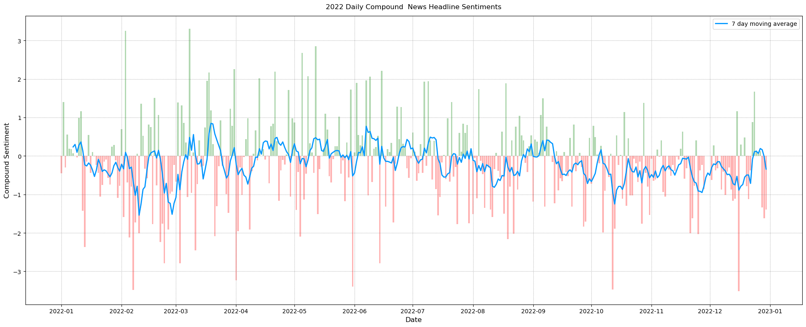

# Yle Sentiments
The repository contains a short sentiment analysis done on YLE's 2021 and 2022 data.

## Datasets
The data was scraped throughout the year from YLE's RSS feed.
Data contains publication date, article headline and the link to the full article.

**DataSample:**

| Date                | Headline                                                     | Link                           |
|---------------------|--------------------------------------------------------------|--------------------------------|
| 2022-01-01 12:50:11 | Finland sees leap in births.                                 | https://yle.fi/news/3-12255208 |
| 2022-01-01 14:40:16 | Finland pays €14 million in compensation to events industry. | https://yle.fi/news/3-12255542 |
| 2022-01-01 16:40:36 | THL recommends reducing quarantine period to five days.      | https://yle.fi/news/3-12260888 |

The full datasets can be found here:

